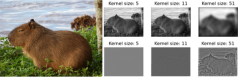
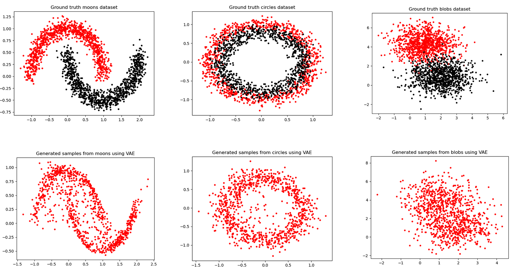
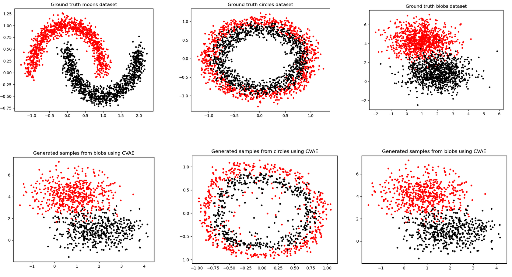

<section id="readme-top"></section>

## Deep Learning

This repository contains various deep learning projects focusing on image processing, natural language processing, and other related tasks.- WIP

### Projects

<strong>1. Multi-Arm Bandit</strong>a href="./MultiArmedBandit/">[code]</a>

The `multi_arm_bandit` directory contains projects related to reinforcement learning using multi-arm bandit algorithms.

#### Description:

- Implementation of epsilon-greedy, UCB1, and Thompson Sampling algorithms for solving multi-armed bandit problems.

#### Results:

<strong>2. Convolution for Image Processing<a href="./convolution/">[code]</a></strong>

The `convolution` directory contains projects related to image processing using convolutional neural networks (CNNs).

#### Results:

  

    
  

  

    <em>Implementation of image smoothing and sharpening using convolution with an average filter.</em>
  

<strong>3. Variational Autoencoder (VAE) and Conditional-VAE</strong><a href="./vae/">[code]</a>

The `vae` directory contains projects related to variational autoencoders (VAEs) and CVAE for generative modeling.

#### Description:

- Implementation of a variational autoencoder architecture for generative modeling tasks.

#### Results:

  

    
    
  

  

    <em>Visualization of VAE and CVAE on moons, circles, and blobs datasets.</em>
  

