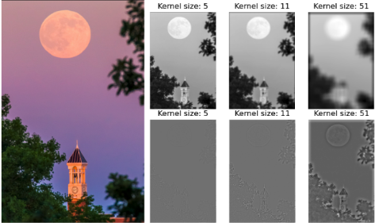

## Convolution for Image Processing

In this project, we explore the application of convolution for image processing, focusing on enhancing and manipulating images using convolutional techniques. The main file for this task is `convolution/main.py`.

### Results

   
   

Figure 1: Smoothed and Sharpened Images

### Objectives:
- **Image Smoothing:** Implement convolution with an average filter to achieve image smoothing, reducing noise and producing a softer appearance.
- **Image Sharpening:** Implement convolution with an average filter, followed by taking the difference, to achieve image sharpening, enhancing edges and details within the image.
