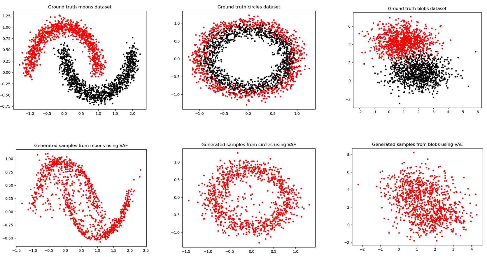
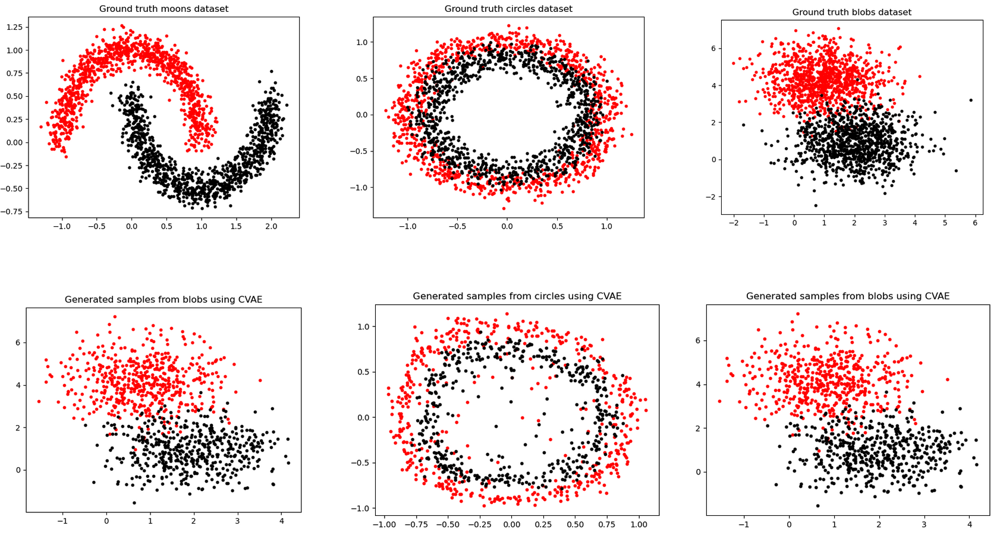

# Variational Autoencoder (VAE) and Conditional Variational Autoencoder (CVAE)

## Description

This repository contains code for implementing Variational Autoencoders (VAEs) and Conditional Variational Autoencoders (CVAEs) for unsupervised learning tasks, generative modeling, and data reconstruction.

<div align="center">
  <div>
    
    
  </div>
  <div align="center">
    <em>Visualization of VAE and CVAE on moons, circles, and blobs datasets.</em>
  </div>
</div>


## Usage

To run the VAE model, use the following commands, replacing `DATASET` with moons, circles, or blobs:

```python
python main.py --model name=vae --cuda=False --dataset=DATASET

python main.py --model name=cvae --cuda=False --dataset=DATASET
```


## Model Architecture

- **Encoder:** Converts input data into a latent space representation using fully connected layers and Leaky ReLU activations.
- **Decoder:** Reconstructs input data from the latent space representation using fully connected layers and Leaky ReLU activations.
- **Reparameterization Trick:** Enables gradient flow during sampling by reparameterizing the latent variable sampling process.
- **Loss Function:** Combines reconstruction loss (measured by MSE) with KL divergence to ensure a structured latent space.
- **Hyperparameter β:** Balances reconstruction loss and KL divergence for effective training.

## Important Concepts

- **Evidence Lower Bound (ELBO):** Maximizes the marginal likelihood of observed data.
- **Reconstruction Loss:** Encourages accurate reconstruction of input data by the decoder.
- **KL Divergence:** Penalizes deviations from the prior distribution of latent variables.
- **Hyperparameter β:** Controls the balance between reconstruction loss and KL divergence.
- **Conditional Variational Autoencoder (CVAE):** Extends VAE by incorporating conditional variables for targeted data generation.

License
Not Distributed

Contact
Your Name - bhat41@purdue.edu

Acknowledgments
- Original VAE Paper: https://arxiv.org/abs/1312.6114
