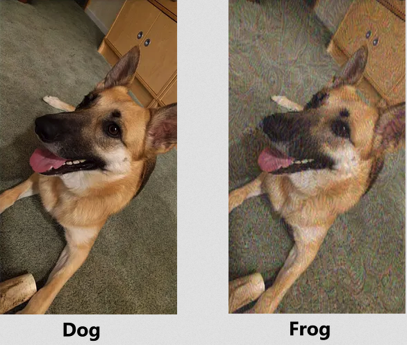
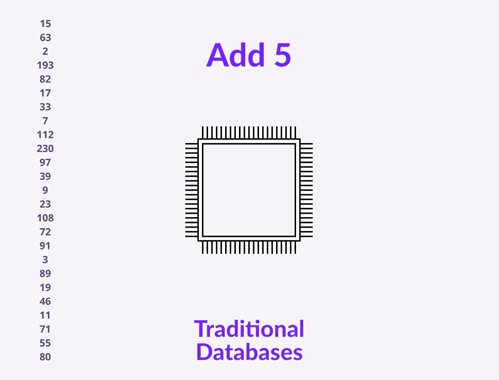
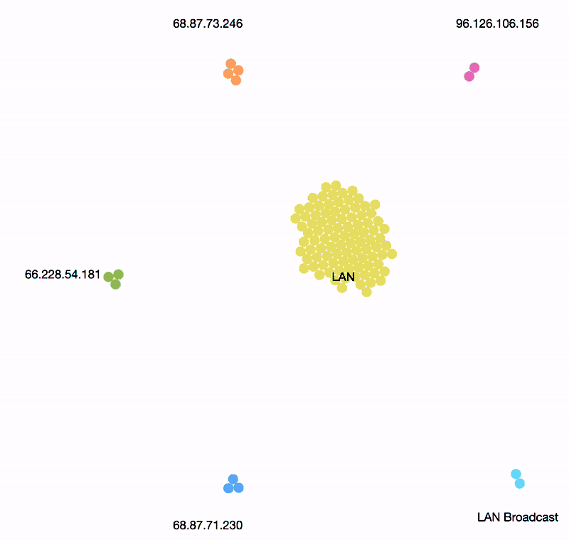
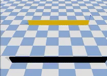
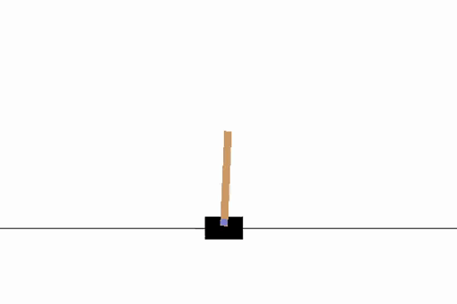

# Main Repository Contents

This repository contains some of my work. Each directory contains distinct projects and studies:

<table>
  <tr>
    <td valign="top"><a href="./DeepLearning"><b>Deep Learning</b></a> - Deep learning code from scratch and classical problems.</td>
    <td valign="top"></td>
  </tr>
  <tr>
    <td valign="top"><a href="./adversarialML"><b>Adversarial ML</b></a> - Focusing on adversarial machine learning. Attacks and defenses in Neural Nets, ensuring dogs are seen as dogs.</td>
    <td valign="top"></td>
  </tr>
  <tr>
    <td valign="top"><a href="./database"><b>Database</b></a> - Database management and optimization techniques.</td>
    <td valign="top"></td>
  </tr>
  <tr>
    <td valign="top"><a href="./hacks"><b>Hacks</b></a> - Utils and hacks.</td>
    <td valign="top"></td>
  </tr>
  <tr>
    <td valign="top"><a href="./networks"><b>Computer Networks</b></a> - Implementations related to computer networks, protocols, and socket programming.</td>
    <td valign="top"></td>
  </tr>
  <tr>
    <td valign="top"><a href="./robotics"><b>Robotics</b></a> - Robotics projects including motion planning, control systems, and RL.</td>
    <td valign="top">
      
      
    </td>
  </tr>
</table>

For more info on work, please visit the respective sub-directory.

## License
Not Distributed

(<a href="#readme-top">back to top</a>)

## Contact

Shivam - <a href="mailto:bhat41@purdue.edu">bhat41@purdue.edu</a> and <a href="mailto:shivambhat02@gmail.com">shivambhat02@gmail.com</a>
