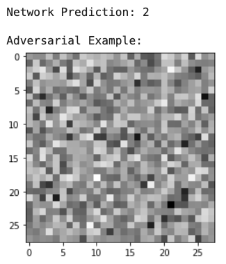
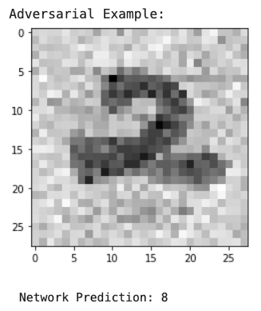
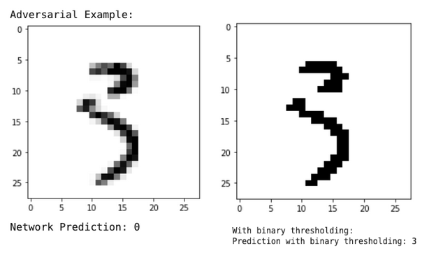
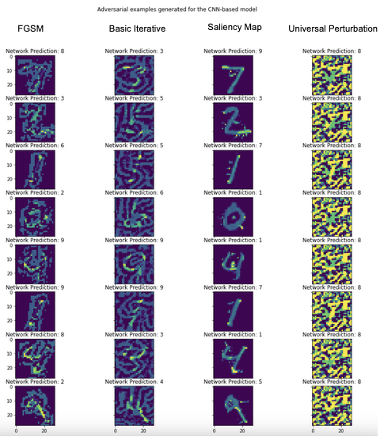
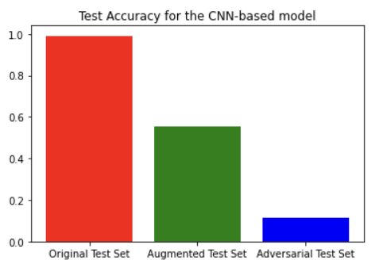
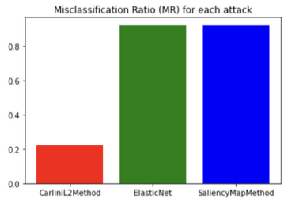
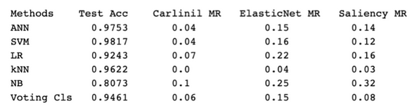
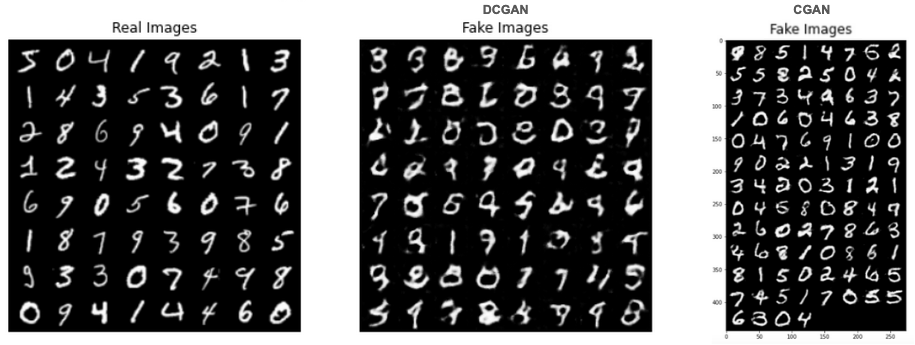

# Adversarial Machine Learning

<!--  -->

<!-- 

 -->

<!-- This is an example file with maximal choices selected.

This is a long description. -->
## Description

This repo dives into challenges and methodologies surrounding the security aspects of machine learning models against adversarial attacks.

## Content

- Attacks on the Machine Learning Pipeline: Poisoning attacks, model theft attacks, adversarial examples, recovery of sensitive training data, and physical-world attacks
- Evasion, Poisoning, and Exploratory Attacks
- Types of Defenses: Pre-processing, and robust optimization
- Introduction to Privacy in Machine Learning: Membership inference and model inversion attacks
- Paper Reviews and Case Studies

## Stack
- **Programming Language:**
  - Python
- **Machine Learning & Deep Learning Libraries:**
  - Scikit-learn
  - TensorFlow
  - Keras
- **Data Processing & Analysis:**
  - Pandas
  - NumPy
- **Documentation:**
  - LaTeX
- **Adversarial Machine Learning:**
  - Adversarial Machine Learning Techniques
  - Evasion Attacks
  - Poisoning Attacks
  - Defense Strategies
  - Model Robustness
- **Tools:**
  - ART (Adversarial Robustness Toolbox)

## Results

Here are some of the results for a quick preview

### Non Targeted Attack

<em> Figure 1:Figure: An illustration of an no targeted evasion attack, where a neural network is tricked into misclassifying an adversarial image as 'Number 2'.</em>

### Targeted Attack

 
<em>Figure 2:Making a Neural Network misclassify a legible 2 adversarial image as 'Number 8'</em>

 

### Defense Strategies Against Adversarial Attacks

  
   
  <em>Figure 3: Demonstrating binary thresholding as an effective defense mechanism against adversarial attacks.</em>

 

### Adversarial Example Generation with IBM ART

  
   
  <em>Figure 4: Adversarial examples created using IBM ART, employing techniques such as FGSM, Basic Iterative Method, Saliency Map Method, and Universal Perturbation.</em>

 

### CNN Performance on Adversarial Examples from IBM ART

  
   
  <em>Figure 5: Evaluating a Convolutional Neural Network's performance in classifying adversarial examples generated by IBM ART.</em>

 

### Exploring Additional Adversarial Attacks with ART

  
   
  <em>Figure 6: Assessing the impact of various Adversarial Robustness Toolbox (ART) attack strategies on neural network performance.</em>

### Transferability of Adversarial Examples

  
   
  <em>Figure 7: Investigating the transferability of adversarial examples across different machine learning classifiers.</em>

 

### Generative Adversarial Networks: DCGAN and CGAN

  
   
  <em>Figure 8: Showcasing the capabilities and outcomes of Deep Convolutional GAN (DCGAN) and Conditional GAN (CGAN) in generating adversarial images.</em>

 

<!-- ## Contributing -->

<!-- Contributions are what make the open source community such an amazing place to learn, inspire, and create. Any contributions you make are **greatly appreciated**.

If you have a suggestion that would make this better, please fork the repo and create a pull request. You can also simply open an issue with the tag "enhancement".
Don't forget to give the project a star! Thanks again!

1. Fork the Project
2. Create your Feature Branch (`git checkout -b feature/AmazingFeature`)
3. Commit your Changes (`git commit -m 'Add some AmazingFeature'`)
4. Push to the Branch (`git push origin feature/AmazingFeature`)
5. Open a Pull Request

<!-- 
(<a href="#readme-top">back to top</a>)
 -->

<!-- LICENSE -->
## License
Not Distributed

<!-- Not Distributed under the MIT License. See `LICENSE.txt` for more information. -->

<!-- 
(<a href="#readme-top">back to top</a>)
 -->

<!-- CONTACT -->
## Contact

[Shivam](https://twitter.com/) - bhat41@purdue.edu

ibmARTper.png

<!-- Project Link: [https://github.com/your_username/repo_name](https://github.com/your_username/repo_name) -->

<!-- 
(<a href="#readme-top">back to top</a>)
 -->

<!-- ACKNOWLEDGMENTS -->
## Acknowledgments
* [Course : CS529](https://beerkay.github.io/cs529/content/syllabus/CS529.pdf)

