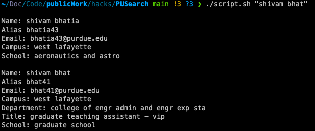

# Purdue Directory Search 🚀

```
A cli interface to search purdue diretory . Long Live Terminal! 
```
<!--  -->
<p align="center">
  
</p>

## Motivation

As a lover of the terminal, I wanted a quick way to access Purdue University's directory without leaving the command line. This shell script allows you to search for information about any Purdue person quickly from your terminal, saving you time and enhancing your coding workflow.

## Usage

1. Make sure you have `curl` installed.

2. Run the script:

    ```bash
    sh purdue_directory_search.sh [NAME]
    ```

    Replace `[QUERY]` with the name of the Purdue person you're looking for.

3. The script will fetch and display relevant information directly in your terminal.

## Features

- **Never Leave The Terminal**: Retrieve Purdue University information without leaving your command line environment.
- **User-Friendly**: Scope for building a powerful tool. Could add linkedin search and many more integrations.
- **User-Friendly**: Get information in a readable format, making it easy to integrate into your workflow.

#### Future Work

- [ ] Deploing your own package. I am HERE rn. Figured somethings . Some more to figure. 
- [ ] Formatting for low occurance rare cases 5% 
- [ ] Integrate more neorks - Scholar/linkedin/facebook - gotta figure out the api
- [ ] Maybe LLM to briefly describe what they are working on

#### Learning
- Curl and sending back raw data in POST 
- Revised shell
- Deploying a BREW package  -- || will add the medium article I followed to deploy your own brew package ||

## Contributing

Contributions are welcome! If you have ideas for improvements or additional features, feel free to submit a pull request.

## License

<!-- This project is licensed under the [MIT License](LICENSE). Enjoy searching the Purdue directory seamlessly from your terminal! 🚀📚 -->
