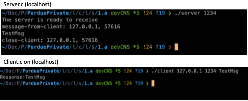
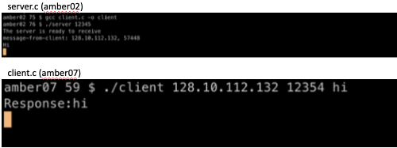
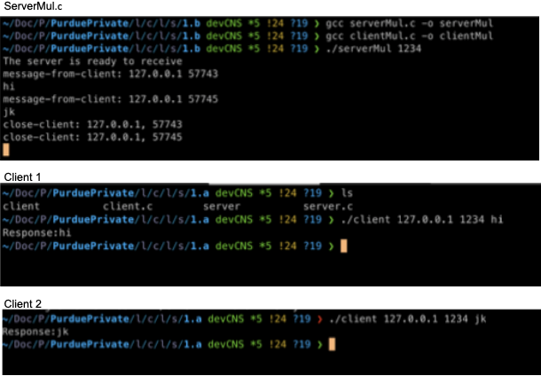

# Computer Networks and Data Communication

<!--  -->

<!-- 

 -->

<!-- This is an example file with maximal choices selected.

This is a long description. -->
## Description

This directory contains work on various topics from computer networks and communication . Each sub-directory has it's own readme explaing in detail the work.

## Content

- [socket and web servers](./socket/) - Socket Programming, HTTP/1.0, HTTP/2.0
- [Network Layer](./socket/) - WIP
- [Wireshark Pcap Analysis](./pcap/) - Python Code to analyze the captured pcap file and extract the packets needed.

## Results

The source code for all projects and analyses can be found in the [`src`](./src) directory. Below are some highlighted results from the work:

### 1. Build Client-Server over Socket Programming
#### Functionality:
1.1. **Client-server communication:**
   - Enable client and server to communicate over TCP/IP sockets.
   - Client sends messages to server, which responds back.
   
1.2. **Support for different machines:**
   - Modify code to accept IP address and port number as command line arguments.
   - Test initially on localhost, then configure for specified machines.
   
1.3. **Multi-client support on server:**
   - Revise server code to handle multiple client connections concurrently using Pthreads.
   - Clients can connect from different machines and interact with the server simultaneously.

 

<em>Figure 1: Server opens a server process to client over TCP on the same machine and port.</em>

 

 

<em>Figure 2: Server opens a server process to client over TCP on different machines and port.</em>

 

 

<em>Figure 3: A single server communicates with multiple clients over TCP connections using Pthreads, each on different machines and ports.</em>

 

<!-- LICENSE -->
## License
Not Distributed

<!-- Not Distributed under the MIT License. See `LICENSE.txt` for more information. -->

<!-- 
(<a href="#readme-top">back to top</a>)
 -->

<!-- CONTACT -->
## Contact

[Shivam](https://twitter.com/) - bhat41@purdue.edu

<!-- Project Link: [https://github.com/your_username/repo_name](https://github.com/your_username/repo_name) -->

<!-- 
(<a href="#readme-top">back to top</a>)
 -->

<!-- ACKNOWLEDGMENTS -->
## Acknowledgments
* [Purdue CS536-Data Communication And Computer Networks ](https://www.cs.purdue.edu/homes/chunyi/teaching/cs536-sp23/cs536-sp23.html)

