# Computer Networks and Data Communication

## Description
<section id="readme-top"></section>
This directory contains work on network communication, featuring socket programming, HTTP protocols, web server development, routing, network layer simulation, and packet analysis.

## Content

1. **Build Client-Server over Socket Programming**
   - Client-server communication
   - Support for different machines
   - Multi-client support on server

2. **Develop a Web Server over HTTP/1.1**
   - Implementation of a simple web server
   - Testing deliverables and error handling

3. **Develop a Web Server over HTTP/2.0**
   - Code modification for HTTP/2.0 support
   - Testing and comparison with HTTP/1.1
   - Deployment and comparison of servers

4. **Network Simulator for Distance Vector Routing**
   - DV routing algorithm implementation
   - Initialization and updates of routing tables

5. **Traffic Routing over Static and Dynamic Topologies**
   - Traffic routing using DV routing algorithm
   - Execution instructions and simulation slots

6. **Capture and Analyze Data Packets**
   - Packet capture using Wireshark
   - Packet analysis for network information
   - Python script for analyzing pcap files

## Stack
<details open>
<summary><strong>Tools and Technologies</strong></summary>

| Category                 | Tools and Technologies                      |
|--------------------------|---------------------------------------------|
| **Programming Languages** | C, C++, Python                                    |
| **Network Protocols**     | TCP/IP, HTTP/1.0, HTTP/1.1, HTTP/2.0         |
| **Networking Concepts**   | Socket Programming, Web Server Development, Distance Vector Routing Algorithm |
| **Course Concepts**       | Client-Server Communication, Multi-threading (Pthreads), Packet Analysis, Routing Algorithms |
| **Tools and Libraries**   | GCC Compiler, Wireshark, Pthreads           |
| **Operating System**      | Unix/Linux                                   |

For more details, please refer to the [course website](https://www.cs.purdue.edu/homes/chunyi/teaching/cs536-sp23/cs536-sp23.html).
</details>


## Results

The source code for all projects and analyses can be found in the [`src`](./src) directory. Below are some highlighted results from the work:

<details>
<summary><strong>1. Build Client-Server over Socket Programming</strong><a href="./src/socket/">[code]</a></summary>
**Deliverables:**
  
#### 1.1. Client-server communication:
- Enable client and server to communicate over TCP/IP sockets.
- Client sends messages to server, which responds back.

#### 1.2. Support for different machines:
- Modify code to accept IP address and port number as command line arguments.
- Test initially on localhost, then configure for specified machines.

#### 1.3. Multi-client support on server:
- Revise server code to handle multiple client connections concurrently using Pthreads.
- Clients can connect from different machines and interact with the server simultaneously.

<div align="center">


<br>
<em>Figure 1.1: Server opens a server process to client over TCP on the same machine and port.</em>
</div>

<br>

<div align="center">


<br>
<em>Figure 1.2: Server opens a server process to client over TCP on different machines and port.</em>
</div>

<br>

<div align="center">


<br>
<em>Figure 1.3: A single server communicates with multiple clients over TCP connections using Pthreads, each on different machines and ports.</em>
</div>
  
</details>

<details>
<summary><strong>2. Develop a Web Server over HTTP/1.1</strong></strong><a href="./src/socket/">[code]</a></summary></summary>

Implement a basic web server (server1.c) with specific HTTP response functionalities, including error handling. Its able to send test files like text.html, picture.html, and bigpicture.html, and handle browser connections for testing.

#### Deliverables:

- **Server Code:** `server1.c`
  - Implementation of a simple web server.

- **Client Code:** `client1.c`
  - Revised client code to test server functionality, with the browser acting as the client in this context.

- **Test Files:**
  - `text.html`: HTML file containing text only.
  - `picture.html`: HTML file containing text and a small picture (< 200KB).
  - `bigpicture.html`: HTML file containing text and a big picture (> 1MB).

#### Testing Deliverables:

- Verify HTTP request format visibility in server console.
- Test server-client interaction for different HTTP requests and responses.
- Connect to the server from a browser using the specified URL format.
- Test server responses for 404 (Not Found), 400 (Bad Request), and 505 (HTTP Version Not Supported) errors.

<div align="center">

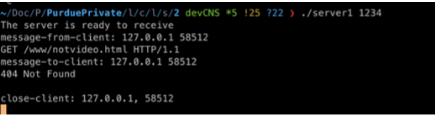
<br>
<em>Figure 2.1: Server listens for client (browser)</em>
</div>

<br>

<div align="center">


<br>
<em>Figure 2.2: Client (browser) sends video and image test</em>
</div>

</details>

<details>
<summary><strong>3. Develop a Web Server over HTTP/2.0</strong><a href="./src/socket/">[code]</a></summary>

Implementation of HTTP/2.0 support in client-server communication for efficient retrieval of multiple webpage objects.

**Deliverables:**

1. **Code Modification:**
   - Update client and server code to support HTTP/2.0.
   - Save modified code as `client2.c` and `server2.c`.

2. **Testing and Comparison:**
   - Deploy server and client locally to compare HTTP/1.1 and HTTP/2.0 performance.
   - Test with `video.html` and analyze loading process differences.
   
3. **Deployment and Comparison:**
   - Deploy HTTP/1.1 and HTTP/2.0 servers on different ports.
   - Run clients on separate hosts to observe simultaneous GET requests.

<div align="center">

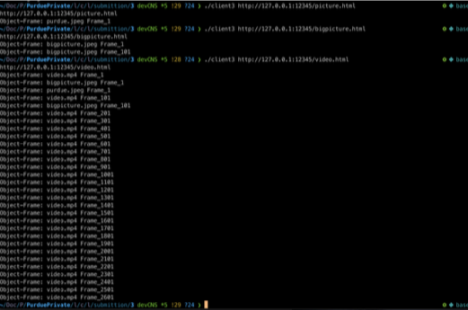
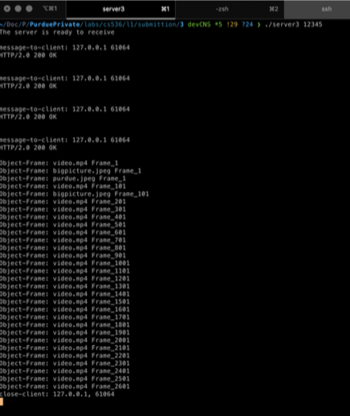
<br>
<em>Figures 3: Client sending HTTP/2.0 requests and server responding to HTTP/2.0 requests.</em>
</div>


</details>

<details>
<summary><strong>4. Network Simulator that Supports Distance Vector Routing</strong><a href="./src/dv/">[code]</a></summary>

Implementing a Distance Vector (DV) routing algorithm involves initializing and updating routing tables per node in a static network topology, ensuring convergence for accurate routing decisions. Key functions include rtinit for initialization and rtupdate for updates based on received packets.

### Execution Instructions:

To compile the code, use the following command:

```bash
gcc mainA.c -o mainA
./mainA 50 "./topo_4.txt"
```

<div align="center">

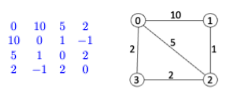
<br>
<em>Figure 4.1: Topology and corresponding link costs</em>
</div>

<br>

<div align="center">

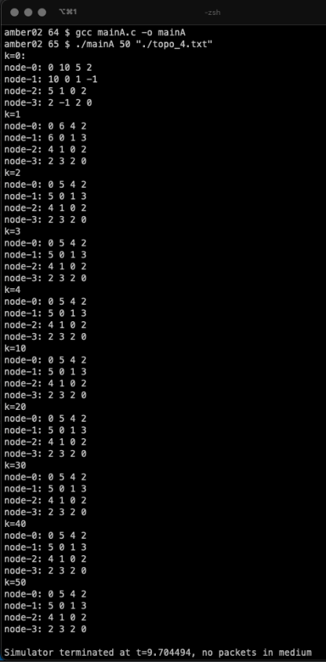
<br>
<em>Figure 4.2: Distance Vector run on given topology</em>
</div>

</details>


<details >
<summary><strong>5. Traffic Routing over a Static Topology</strong><a href="./src/dv/">[code]</a></summary>

Implement traffic routing using the generated forward table from the DV routing algorithm to route incoming network traffic.

### Execution Instructions:

To compile the code, use the following command:

```bash
gcc mainB.c -o mainB
./mainB 12 "./topo_4.txt" "./traffic_4.txt"

#[structure]
./mainB k max [Input topo file path] [Input traffic file path]
# where k max is the maximum number of simulation slots to make algorithm converge.
```


<div align="center">

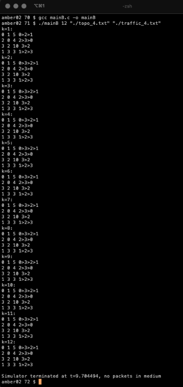
<br>
<em>Figure 5.1: Traffic Routing over a Static Topology</em>
</div>

</details>


<details >
<summary><strong>6. Traffic Routing over a Dynamic Topology</strong><a href="./src/dv/">[code]</a></summary>

Update link costs based on current traffic volume, incorporating packet transmission rates between nodes. Execute Part 5 functionalities first at each simulation slot, followed by updating link costs. These updated costs will inform the next slot's DV updates for efficient routing.

### Execution Instructions:

To compile the code, use the following command:

```bash
gcc mainC.c -o mainC
./mainC 12 "./topo_4.txt" "./traffic_4.txt"
```


<div align="center">

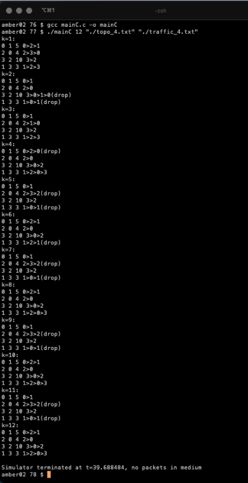
<br>
<em>Figure 5.1: Traffic Routing over a dynamic Topology</em>
</div>

</details>


<details >
<summary><strong>7. Capture and Analyze Data Packets</strong><a href="./src/pcap/">[code]</a></summary>

Update link costs based on current traffic volume, incorporating packet transmission rates between nodes. Execute Part 5 functionalities first at each simulation slot, followed by updating link costs. These updated costs will inform the next slot's DV updates for efficient routing.

### Deliverables:
1. **Packet Capture using Wireshark:**
   - Capture WiFi packets with Wireshark, saving as a pcap file.

2. **Packet Analysis with Wireshark:**
   - Analyze captured packets to find :
    - (a) Obtain IP and MAC address of a gateway router.
    - (b) Determine the IP address used by google.com.
    - (c) Identify packets relevant to intra-AS or inter-AS routing.
    - (d) Find packets for TCP three-way handshaking.
    - (e) Locate HTTP GET and response messages.

3. **Packet Analysis Code:**
   - Python3 Script to analyze the captured pcap file.
        - CASE A: Gateway router IP and MAC addresses.
        - CASE B: Destination website IP address.
        - CASE C: Packets for TCP three-way handshaking.

<div align="center">
  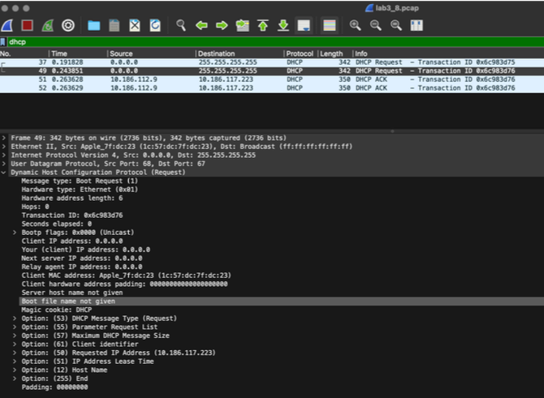
  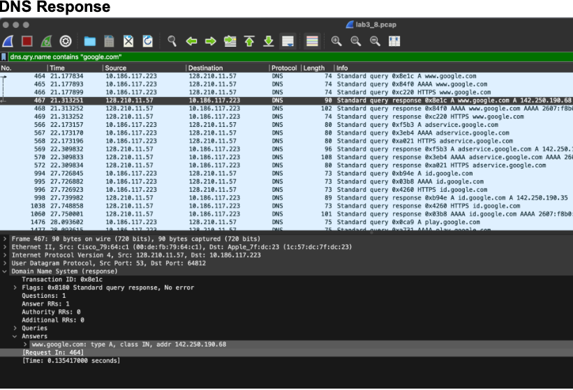
  <br>
  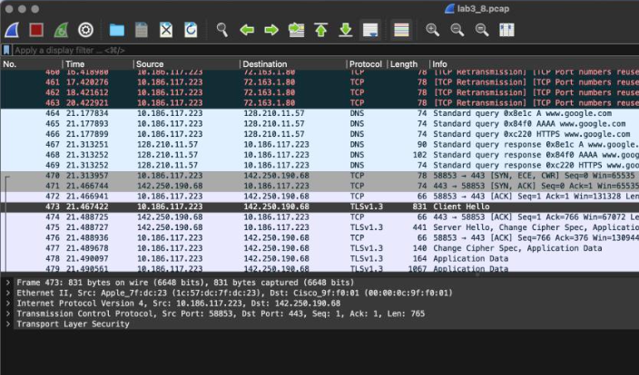
  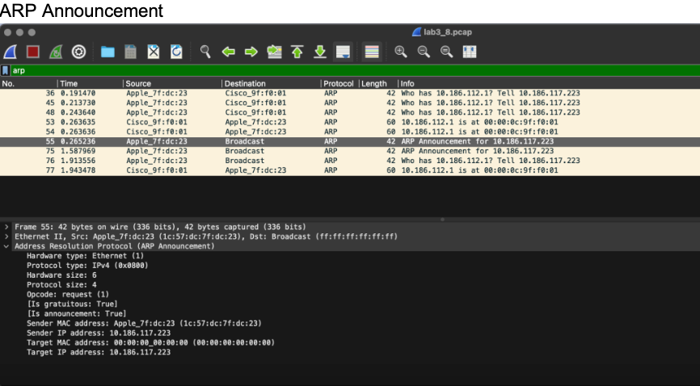
  <br>
  <em>Figure 7.1: Steps for a data packet transfer over a network - DHCP, ARP, TCP Handshake etc.</em>
</div>


### Execution Instructions:

To compile the code, use the following command:

```python
python lab3.py [CASE] [Input pcap file] [Destination website]
# extracts - Gateway router IP and MAC addresses, Destination website IP address. TCP three-way handshaking.
```

<div align="center">

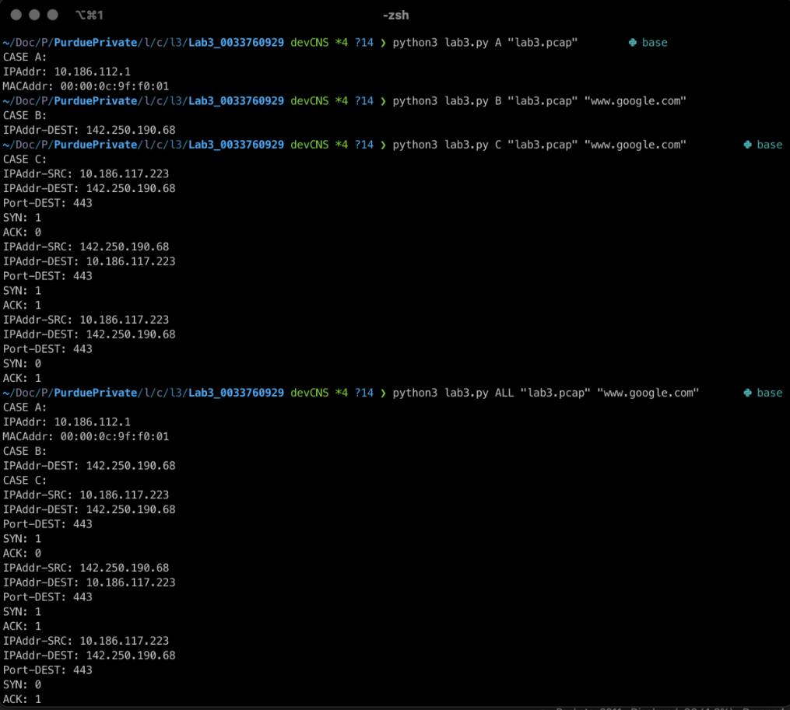
<br>
<em>Figure 7.2: Python script to extract network information from a pcap file</em>
</div>


## License
Not Distributed

<p align="right">(<a href="#readme-top">back to top</a>)</p>

<!-- CONTACT -->
## Contact

Shivam - [bhat41@purdue.edu](mailto:bhat41@purdue.edu)


<!-- ACKNOWLEDGMENTS -->
## Acknowledgments
* [Course : CS536 - Data Communication And Computer Networks](https://www.cs.purdue.edu/homes/chunyi/teaching/cs536-sp23/cs536-sp23.html)
