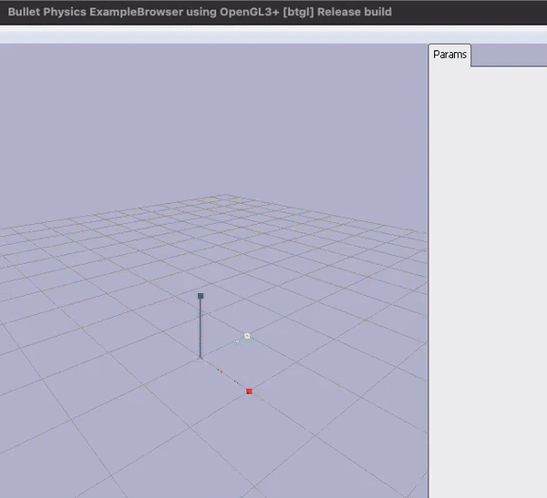
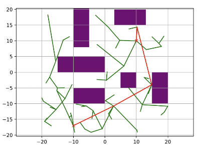
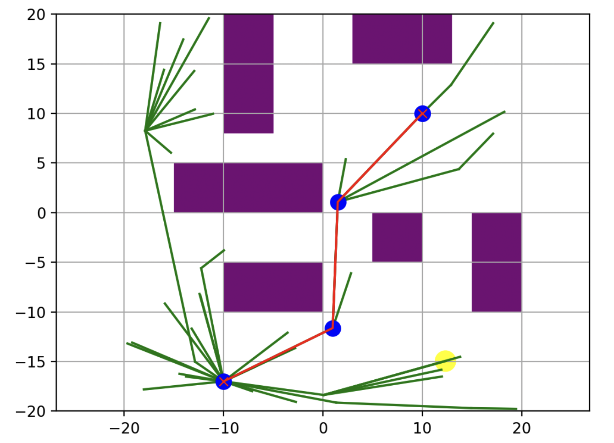
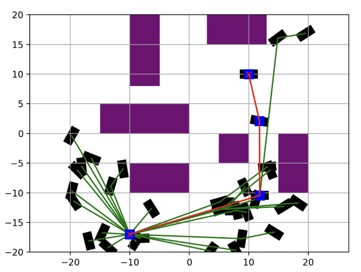
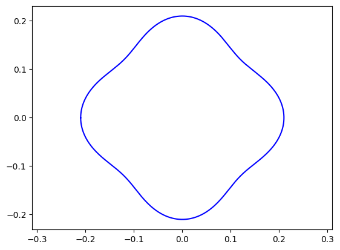
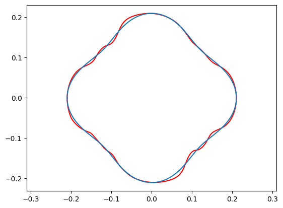
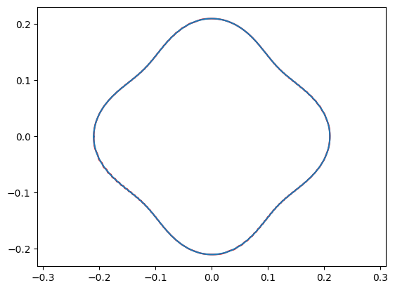
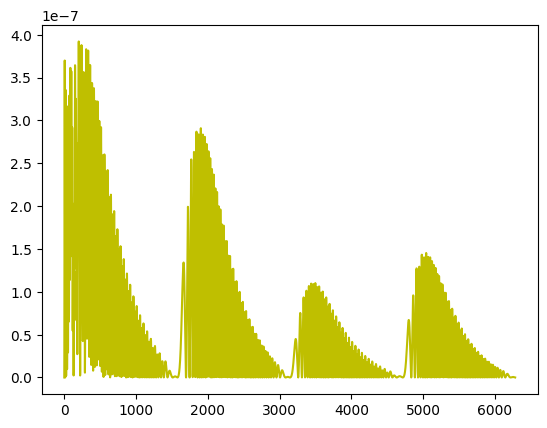
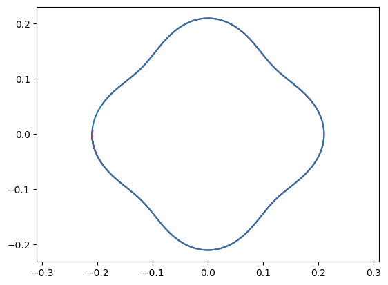
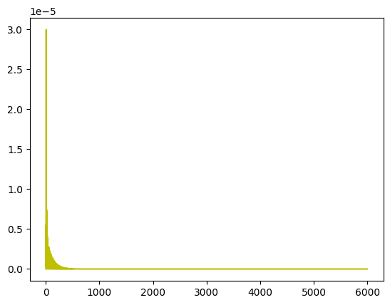

# Robotics

<!--  -->

<!-- 

 -->

<!-- This is an example file with maximal choices selected.

This is a long description. -->
## Description
<section id="readme-top"></section>
This directory contains work on network communication, featuring socket programming, HTTP protocols, web server development, routing, network layer simulation, and packet analysis.

## Content

- [Imitation Learning](https://github.com/apoc146/roboticsProject/tree/main) - RRT* guided Imitation Learning for a TurtleBot robot
- [Controller](./controller/) - Classical Control
- [Motion Planning](./motionPlanning/) - Sample-based motion planning
- [Policy Gradient](./policyGradient) -  Policy gradient methods to solve gym environments(<b>CartPole-v1 and 2 Link Arm</b>) with discrete and continuous action spaces
- [mpnet](./mpnet) - Motion Plannig Neural Networks

<b>1. RRT (Rapidly-exploring Random Tree) in 3D Environment</b><a href="./src/socket/" style="color: #40A2E3; font-weight: bold;"> [code]</a>

- Applied to a 3-DOF UR5 robot arm for collision-free navigation to a target position.

 
<em>Figure 1.1: Visualization of RRT in a 3D Environment</em>

<b>2. BiRRT (Bidirectional Rapidly-exploring Random Tree) in 3D Environment</b><a href="./src/socket/" style="color: #40A2E3; font-weight: bold;"> [code]</a>

- Implements BiRRT. Enhances efficiency by initiating search from both the start and goal positions.

<b>3. Path Smoothing for BiRRT</b><a href="./src/socket/" style="color: #40A2E3; font-weight: bold;"> [code]</a>

- Refines the path found by BiRRT to minimize the number of nodes and create a more direct route.

<b>4. RRT* (Rapidly-exploring Random Trees Star) in 2D Environment</b><a href="./src/socket/" style="color: #40A2E3; font-weight: bold;"> [code]</a>

- Used for optimizing the path for different robot systems, including 2D point-mass, circular rigid body, and rectangular rigid body.

  
  &nbsp;&nbsp;&nbsp;&nbsp;
  
  &nbsp;&nbsp;&nbsp;&nbsp;
  
   
  <em>Visualization of RRT* algorithms in 2D environment for circular and rectangular rigid bodies</em>

<b>5. PD Controller Trajectory Tracking for 2-DOF Robotic Arm</b><a href="./src/controllers/" style="color: #40A2E3; font-weight: bold;"> [code]</a>

The results of a 2-DOF robotic arm using two different PD control strategies are presented below. The first strategy corrects movement <strong>based on the end-effector's positional error</strong>, while the second strategy adjusts <strong>using joint angle errors computed via Inverse Kinematics (IK)</strong>.

<b>X-Y PD Controller</b><a href="./src/x-y-controller/" style="color: #40A2E3; font-weight: bold;"> [code]</a>

This controller uses the Jacobian to convert the end-effector's positional error into corrective joint torques. The target trajectory is shown in blue, and the actual ones in red.

<table>
  <tr>
    <td style="text-align: center; width: 25%;">
       
      <em>Figure 5.1: Target trajectory (in blue).</em>
    </td>
    <td style="text-align: center; width: 25%;">
       
      <em>Figure 5.2: Intermediate `kp` and `kd` values (in red).</em>
    </td>
    <td style="text-align: center; width: 25%;">
       
      <em>Figure 5.3: Best controlled path (in red).</em>
    </td>
    <td style="text-align: center; width: 25%;">
       
      <em>Figure 5.4: MSE error plot for the best trajectory.</em>
    </td>
  </tr>
</table>

<b>IK-Based PD Controller</b><a href="./src/ik-controller/" style="color: #40A2E3; font-weight: bold;"> [code]</a>

Differing from the X-Y approach, this method uses joint angles derived through IK for error calculation and control.

<table>
  <tr>
    <td style="text-align: center; width: 50%;">
         
        <em>Figure 5.5: Trajectory result using IK-based PD controller.</em>
    </td>
    <td style="text-align: center; width: 50%;">
         
        <em>Figure 5.6: Error plot using IK-based PD controller.</em>
    </td>
  </tr>
</table>

## Contributing

Contributions are what make the open source community such an amazing place to learn, inspire, and create. Any contributions you make are **greatly appreciated**.

If you have a suggestion that would make this better, please fork the repo and create a pull request. You can also simply open an issue with the tag "enhancement".
Don't forget to give the project a star! Thanks again!

1. Fork the Project
2. Create your Feature Branch (`git checkout -b feature/AmazingFeature`)
3. Commit your Changes (`git commit -m 'Add some AmazingFeature'`)
4. Push to the Branch (`git push origin feature/AmazingFeature`)
5. Open a Pull Request

<!-- 
(<a href="#readme-top">back to top</a>)
 -->

<!-- LICENSE -->
## License
Not Distributed

<!-- Not Distributed under the MIT License. See `LICENSE.txt` for more information. -->

<!-- 
(<a href="#readme-top">back to top</a>)
 -->

<!-- CONTACT -->
## Contact

[Shivam](https://twitter.com/) - bhat41@purdue.edu

<!-- Project Link: [https://github.com/your_username/repo_name](https://github.com/your_username/repo_name) -->

<!-- 
(<a href="#readme-top">back to top</a>)
 -->

<!-- ACKNOWLEDGMENTS -->
## Acknowledgments
* [Purdue CS593-Robotics](https://qureshiahmed.github.io/sp23.html)

