# Robotics

<!--  -->

<!-- 

 -->

<!-- This is an example file with maximal choices selected.

This is a long description. -->
## Description
<section id="readme-top"></section>
This directory contains work on network communication, featuring socket programming, HTTP protocols, web server development, routing, network layer simulation, and packet analysis.

## Content

- [Imitation Learning](https://github.com/apoc146/roboticsProject/tree/main) - RRT* guided Imitation Learning for a TurtleBot robot
- [Controller](./controller/) - Classical Control
- [Motion Planning](./motionPlanning/) - Sample-based motion planning
- [Policy Gradient](./policyGradient) -  Policy gradient methods to solve gym environments(<b>CartPole-v1 and 2 Link Arm</b>) with discrete and continuous action spaces
- [mpnet](./mpnet) - Motion Plannig Neural Networks

<b>1. RRT (Rapidly-exploring Random Tree) in 3D Environment</b><a href="./src/socket/" style="color: #40A2E3; font-weight: bold;"> [code]</a>

- Applied to a 3-DOF UR5 robot arm for collision-free navigation to a target position.

 
<em>Figure 1.1: Visualization of RRT in a 3D Environment</em>

<b>2. BiRRT (Bidirectional Rapidly-exploring Random Tree) in 3D Environment</b><a href="./src/socket/" style="color: #40A2E3; font-weight: bold;"> [code]</a>

- Implements BiRRT. Enhances efficiency by initiating search from both the start and goal positions.

<b>3. Path Smoothing for BiRRT</b><a href="./src/socket/" style="color: #40A2E3; font-weight: bold;"> [code]</a>

- Refines the path found by BiRRT to minimize the number of nodes and create a more direct route.

<b>4. RRT* (Rapidly-exploring Random Trees Star) in 2D Environment</b><a href="./src/socket/" style="color: #40A2E3; font-weight: bold;"> [code]</a>

  Used for optimizing the path for different robot systems, including 2D point-mass, circular rigid body, and rectangular rigid body.

  
  
  

  <em>Visualization of RRT* algorithms in 2D environment for circular and rectangular rigid bodies</em>

<b>5. PD Controller Trajectory Tracking for 2-DOF Robotic Arm</b><a href="./src/controllers/" style="color: #40A2E3; font-weight: bold;"> [code]</a>

The results of a 2-DOF robotic arm using two different PD control strategies are presented below. The first strategy corrects movement <strong>based on the end-effector's positional error</strong>, while the second strategy adjusts <strong>using joint angle errors computed via Inverse Kinematics (IK)</strong>.

<b>X-Y PD Controller</b><a href="./src/x-y-controller/" style="color: #40A2E3; font-weight: bold;"> [code]</a>

This controller uses the Jacobian to convert the end-effector's positional error into corrective joint torques. The target trajectory is shown in blue, and the actual ones in red.

  
  
  
   
  <em>Figures 5.1 to 5.3: Trajectory tracking with X-Y PD Controller; Target (blue) and Actual (red)</em>

<b>IK-Based PD Controller</b><a href="./src/ik-controller/" style="color: #40A2E3; font-weight: bold;"> [code]</a>

Differing from the X-Y approach, this method uses joint angles derived through IK for error calculation and control.

  
  
   
  <em>Figures 5.4 and 5.5: Trajectory and error plotting with IK-Based PD Controller</em>

<b>6. Autonomous Track Navigation with PID Controllers</b> <a href="./src/adaptive_controller/" style="color: #40A2E3; font-weight: bold;">[code]</a>

Implements a adaptive controller to navigate a race car across varied tracks, optimizing wheel angle and thrust for maximum speed and accuracy, with performance gauged by cumulative rewards.

  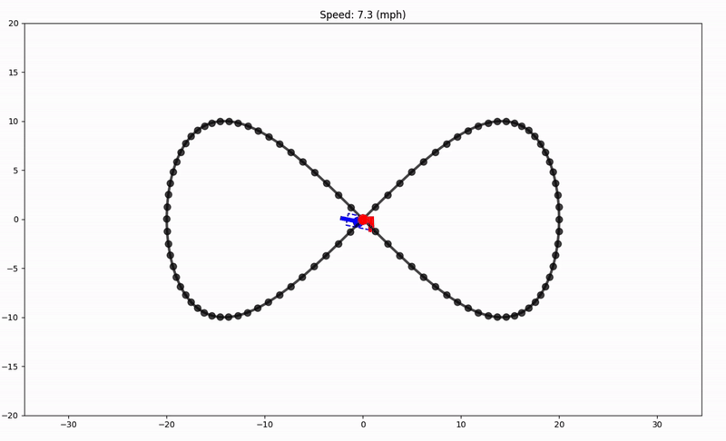
  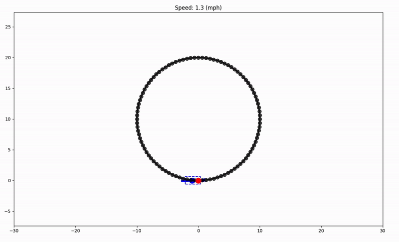
  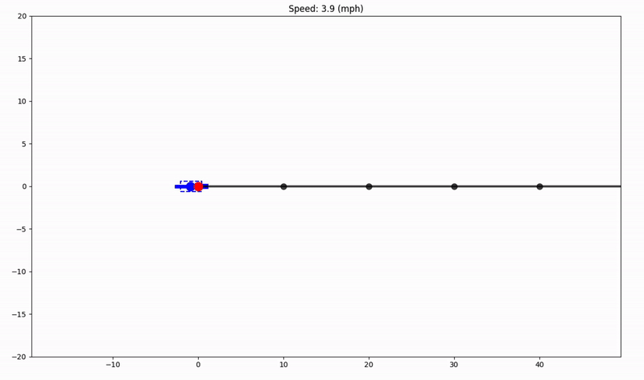

  <em>PID Controller strategy on FigureEight, Circle, and Linear tracks

<b>7. MPNets - Neural Network based Motion Planning*</b> <a href="./src/mpnet_rrt_star/" style="color: #40A2E3; font-weight: bold;">[code]</a> [<a href="https://arxiv.org/abs/1806.05767" style="color: #40A2E3; font-weight: bold;">paper</a>]

MPNet implementation for efficient robotics motion planning in 2D/3D, integrating Dropout and Lazy Vertex Contraction for enhanced pathfinding. Combines MPNet's learning efficiency with RRT*'s optimization, showcasing pathfinding improvements in complex environments.

  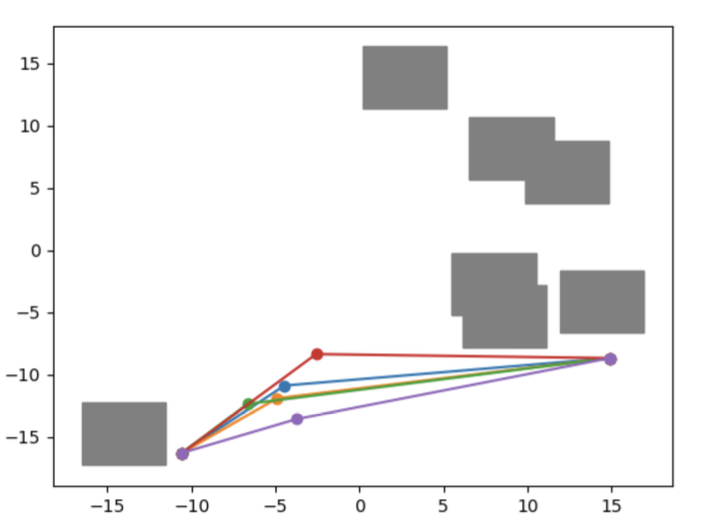
  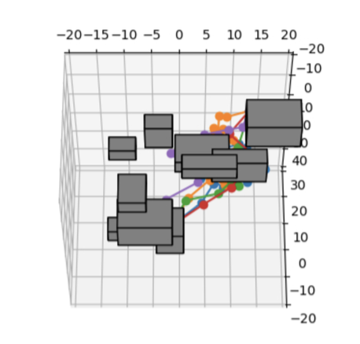
  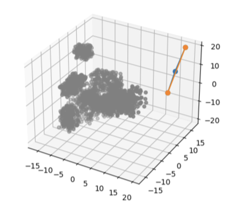
  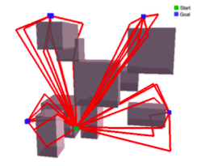

  <em>MPNet applications: 2D environment, 3D environment, and point cloud navigation.</em>

<b>8. Reinforcement Learning with Policy Gradients for CartPole and 2 Link Arm</b>

We implement and compare different policy gradient methods, including:

- **Vanilla Policy Gradient (VPG)**: For the `CartPole-v1` environment, we use the objective function illustrated below. This represents the policy gradient, averaged over n episodes.
  

    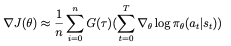
  

- **Reward-to-Go Policy Gradient**: This method focuses on the future rewards for each action at time t, suitable for both environments. The equation is as follows:
  

    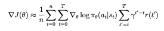
  

- **Baseline-Subtracted Policy Gradient**: Incorporating a baseline b and normalizing rewards by standard deviation σ to reduce variance. The equation is detailed below:
  

    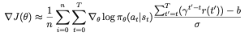
  

### Results for Each Policy

  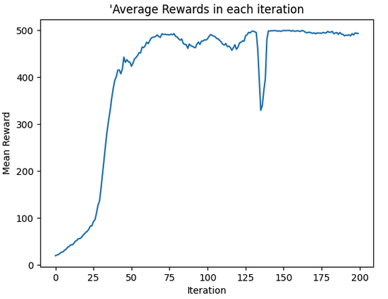
  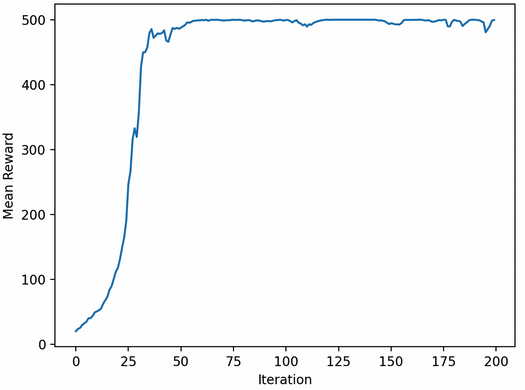
  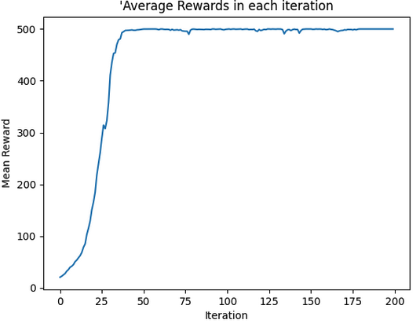

  <em>Top row: Equations for each policy gradient method. Bottom row: Corresponding results.</em>

### Simulation Results

  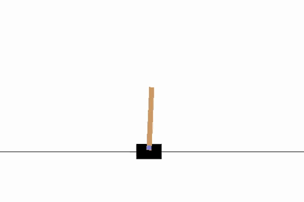
  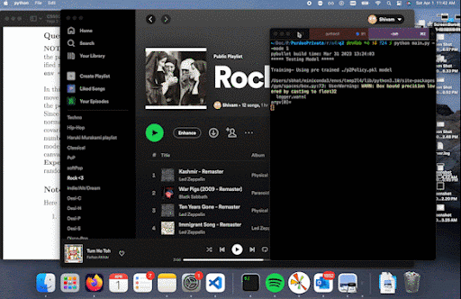

  <em>The CartPole agent learns to maintain balance (left), while the 2 Link Arm successfully reaches its target positions (right).</em>

## Contributing

Contributions are what make the open source community such an amazing place to learn, inspire, and create. Any contributions you make are **greatly appreciated**.

If you have a suggestion that would make this better, please fork the repo and create a pull request. You can also simply open an issue with the tag "enhancement".
Don't forget to give the project a star! Thanks again!

1. Fork the Project
2. Create your Feature Branch (`git checkout -b feature/AmazingFeature`)
3. Commit your Changes (`git commit -m 'Add some AmazingFeature'`)
4. Push to the Branch (`git push origin feature/AmazingFeature`)
5. Open a Pull Request

<!-- 
(<a href="#readme-top">back to top</a>)
 -->

<!-- LICENSE -->
## License
Not Distributed

<!-- Not Distributed under the MIT License. See `LICENSE.txt` for more information. -->

<!-- 
(<a href="#readme-top">back to top</a>)
 -->

<!-- CONTACT -->
## Contact

[Shivam](https://twitter.com/) - bhat41@purdue.edu

<!-- Project Link: [https://github.com/your_username/repo_name](https://github.com/your_username/repo_name) -->

<!-- 
(<a href="#readme-top">back to top</a>)
 -->

<!-- ACKNOWLEDGMENTS -->
## Acknowledgments
* [Purdue CS593-Robotics](https://qureshiahmed.github.io/sp23.html)

